# Motivation

```{r setup, include=FALSE}
#knitr::opts_chunk$set(echo = FALSE)
library(uasimg)
```

```{css echo = FALSE}
div.quote {
  width:1000px;
  margin:4em auto;
  line-height:52px;
  font-size:40px;
  font-family: 'Book Antiqua', 'Palatino Linotype', Palatino, serif;
}
  
span.quotechar {
  color:lightgray; 
  font-family:century-supra-text;
  font-size: 220%;  
}

ul {
  margin-left: 2.5em;
}
h1 {
  color:#111;
}
h2 {
  font-size:1.2em;
  color:#007020;
}
```


<script language="javascript" type="text/javascript">w3c_slidy.mouse_click_enabled = false;</script>

## Data for Drone Mapping 

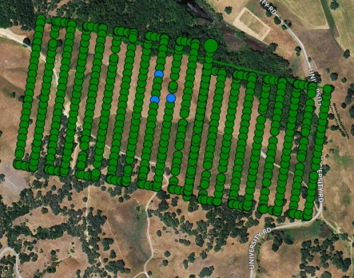{style="margin-left:5px;"}

\

## Volume and Variety

<div style="float:left; width:260px; margin-left:2em; line-height:1.65em;">
raw images  
flight log  
study area outline  
GCP coordinates  
telemetry files  
ground samples  
other photos  
video files
basemap layers
</div>

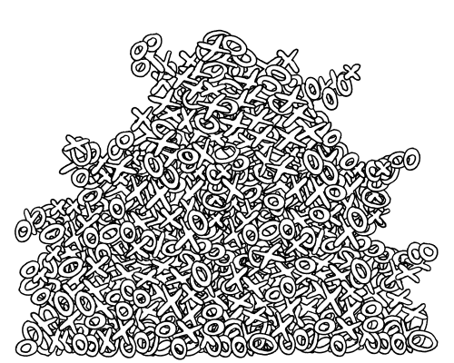

<div style="clear:both;"></div>

--- 

<div class="quote" style="margin-top:1em;"><span class="quotechar">&ldquo;</span>
I know it's here somewhere.
<span class="quotechar">&rdquo;</span><br/><br/>
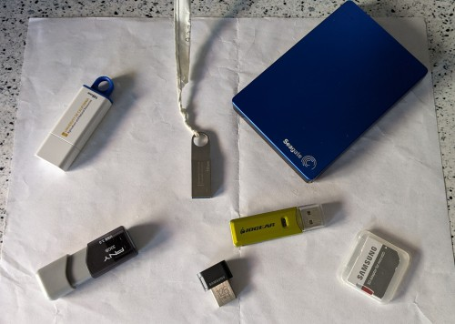</div>


---

<div class="quote"><span class="quotechar">&ldquo;</span>
Yeah I remember hearing someone flew that site. Did you ask Brandon?
<span class="quotechar">&rdquo;</span></div>

---

<div class="quote"><span class="quotechar">&ldquo;</span>
I found the images, but I can't reproduce the stitching. It looks funny.<br/><br/>Maybe the overlap was too low?
<span class="quotechar">&rdquo;</span></div>

---

<div class="quote"><span class="quotechar">&ldquo;</span>
We have to report how many acres we've flown with each type of camera for the USDA report.<br/><br/>Whatdyathink?
<span class="quotechar">&rdquo;</span></div>

---

<div class="quote">
How do we get our drone data to be FAIR compliant?<br/><br/>
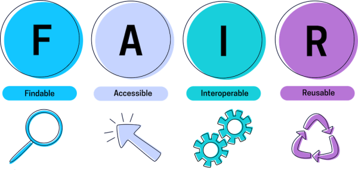
</div>

# `uasimg` Overview

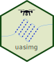R package with functions to help you:

* create catalogs of your images
* record your flight metadata
* create GIS data of your data collections
* store your images in a data structure that will allow you to find them again
* share your data / metadata with others
* utilities for unstitchable images
* deal with annoying data management tasks

# Data Catalog Tour

<a href="http://gis-ubuntu.ucanr.edu/uas/hrec/riverfire2020/catalogs/msp/" target="_blank" rel="noopener">
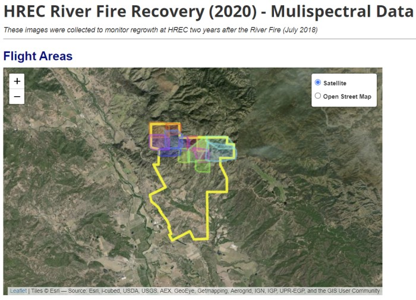
</a>

# Origins

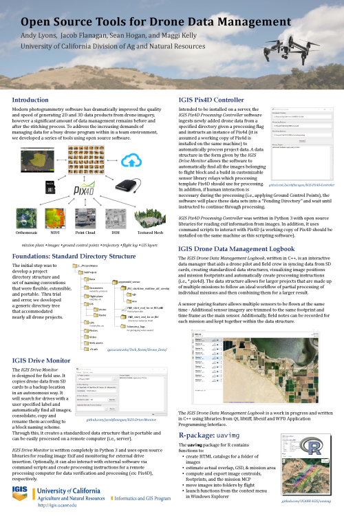{style="border:5px solid lightgrey; padding:5px;"}  
<https://is.gd/uas_data_aag2019>

\

## Why R?

  

* full featured scripting language  
* wrappers for open source libraries (exiftool, gdal, geos)  
* good reporting engine  
* good deployment system  
* good tools to create GUIs

# Step 1. Extract Image EXIF Data

```{r eval = FALSE}
ptpinole_info = uas_info("d:/uas/ptpinole/west/march2020/dcim")
```

This will:

1) extract the image coordinates
2) read the sensor type, location, yaw, focal length, etc.
3) compute image footprints
4) create an minimum convex polygon (MCP) for the entire flight
5) read flight metadata
6) cache all the results
7) return a "Flight Info" object

You can process multiple directories at once
 
A "Flight Info" object by itself is not very useful! 

# Step 2. Create / Edit Flight Metadata

## Image metadata vs Flight Metadata

<div style="margin-left:2em;">

**Image metadata**

* camera model, location, orientation, focal length, aperture  
* stored in the images  
* essential for photogrammetry  

**Flight metadata**

* name of the project, location, pilot, aircraft, flight notes
* not critical for photogrammetry, but essential for good data management
* `uasimg` uses flight metadata for i) **cataloging**, ii) **searching**, and iii) **creating directory trees**  
* see also the [Flight Metadata](https://ucanr-igis.github.io/uasimg/articles/flight_metadata.html){target="_blank" rel="noopener"} Vignette.

</div>

\

## Entering Flight Metadata

Recommended way to record flight metadata - Notepad!

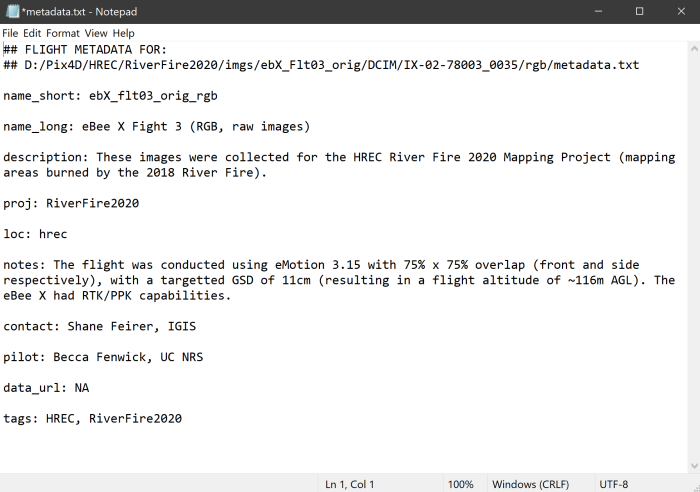{style="border:1px solid gray;"}  

* Any field name allowed  
* Defaults:

<div style="margin:0 2em;">

```{r}
uas_flds_oem()
```
</div>

\

## Flight Metadata Helper Functions

You don't have to start from scratch!

```{r eval=FALSE}
uas_metadata_make(ptpinole_info)
```

- create a *metadata.txt* file for every image directory in *x*  
- customize field names with `uas_setflds()`  
- can prepopulate values from a template ([example](https://gist.githubusercontent.com/ajlyons/d0826f4775413ba27a21c62aff619bc2/raw/a6f3dde133652a729283b0e03f8a923f54f73a67/hrec_riverfire2020_metadata){target="_blank" rel="noopener"})  
- open them in text editor  

\

Re-run `uas_info()` after you edit flight metadata!

# Step 3. Export flight geometry as GIS files


```{r eval = FALSE}
uas_exp_kml(ptpinole_infox)
uas_exp_shp(ptpinole_info)
```

* image center points
* footprints  
* flight MCP  
* default ouptut folder is a 'map' subfolder of the image directory

# Move Your Data into Standard Directory Trees

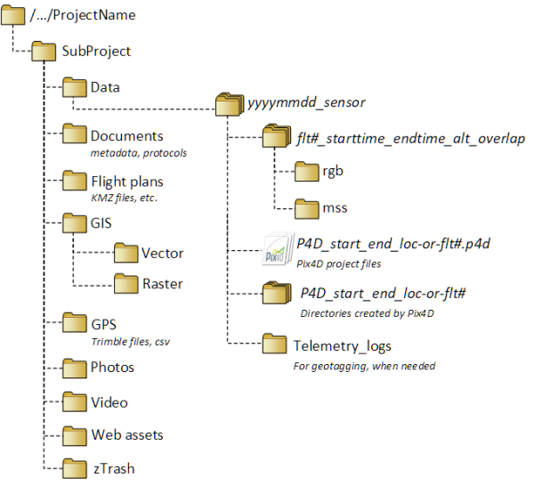

You can move your data by hand or with a function:

```{r eval=FALSE}
uas_move(ptpinole_info)
```

Function options:

* move or copy images
* create the directory tree from a template text file:

<div style="font-family:monospace; font-size:16px; margin:1em 4em; border:1px solid gray; background-color:#eee;">
{proj}/{loc}/{subloc}/imgs/{flt_date}/{flt_start}-{flt_end}_{camera_abbrev}  
{proj}/{loc}/{subloc}/gis  
{proj}/{loc}/{subloc}/p4d  
{proj}/{loc}/{subloc}/documents  
</div>

* placeholders in {} will be replaced with flight and/or image metadata   
* you can use *any* flight metadata field and a subset of image metadata fields  
* the first directory should be where you want the images from a single flight to go  

# Create a Flight Summary Report

Create HTML flight summary for one or more Flight Info object(s):

```{r eval = FALSE}
uas_report(ptpinole_info)
```

Report options:

- report title
- HTML header / footer
- group image locations into 'clusters'
- show image thumnbnails
- custom header / footer (in HTML)
- show the directory where the images are saved on your local machine
- hyperlinks to download the KML files
- download satellite image thumbnail (requires Google API key)  
- output directory (default is 'map' sub-directory)

# Group Flight Summary Reports into a Table of Contents

Feed a list of Flight Summary HTML files. 

```{r eval=FALSE}
uas_toc(c("d:/uas/ptpinole/west/march2020/dcim/map/ptpinole_mar2020.html",
          "d:/uas/ptpinole/west/jul2020/dcim/map/ptpinole_jul2020.html",
          "d:/uas/ptpinole/west/oct2020/dcim/map/ptpinole_oct2020.html"))
```

It will extract flight metadata fields from the HTML file for the table-of-contents.

Function options:

- title & HTML header/footer  
- copy all the individual Flight Summary HTML files to one place  
- show a map of all the flight areas  
- include hyperlinks to download all flight areas as a single KML  


# Utilities for Unstitchable Images

## World Files

'World Files' are plain-text files (also called sidecar files) with projection info for an image / dataset. 

GIS software like ArcGIS Pro and QGIS use these files to display images in the proper place and size.

Generate with:

```{r eval = FALSE}
uas_worldfile(ptpinole_info)
```

Function options:

* World File format (`aux.xml`, `wld`, or `prj`)
* model yaw rotation   

\

Output:

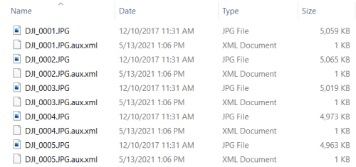{style="border:1px solid lightgrey; maring-left:5px;"}

\

With World files images will just "pop" into place (approximately):

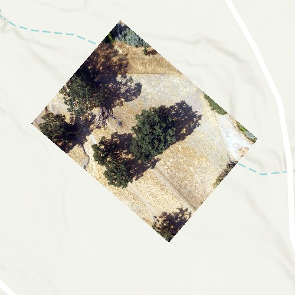


# Crop Out Overlap

If your images can't be stitched, life is not over!

This function will crop each image, keeping the center part (least distorted)

```{r eval = FALSE}
uas_cropctr(ptpinole_info)
```

Function options:

* specify the crop dimensions in the image horizontal and vertical axis in meters

Example Output:

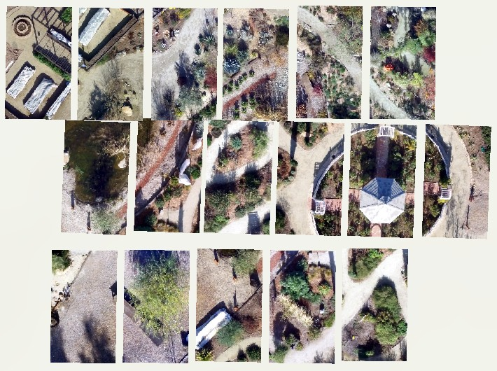

Not great, but...

* If the ground is flat and the features are short, might be good enough.  
* If you're counting things in individual images, might be good enough.  
* If you know you won't be able to stitch images (i.e., open water), consider flying at "zero percent" overlap and use this technique to verify you're not double-counting.

# Annoying Tasks: Convert file formats

Convert between JPG, TIF, and DNG without losing all the image metadata (EXIF info):

```{r eval = FALSE}
uas_convert()
```

\


# In the pipeline...

## Scaling for Production

* `uas_dirs_find()` - find all directories with image files  
* automate production with an Excel based control panel  
* tips and tricks for production processing  
* Shiny GUI (?)

## Tools to get to "one flight per folder"

* multiple flights in one folder - split  
* one flight spread across multiple directories - merge  
* handle the details with renaming files, flight metatadata, log and calibration files, etc.  

## Make your data findable

* generate XML files for Google Dataset Search  
* publishing your data catalogs as AGOL web maps  

## Catalog Processed Data

* add links to processed data  
* ingest the Pix4D / Metashape quality reports (processing settings, quality metrics)

# Summary

The need for data management tools and workflows increases as you:

- accumulate more and more data  
- work in a team  
- are mandated to archive your data for the long term  
- are mandated to make the existence of your data known to others  

<div style="width:500px; margin:2em auto; text-align:center;">
<br/>
https://ucanr-igis.github.io/uasimg/
</div>


