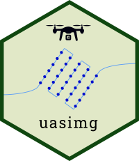
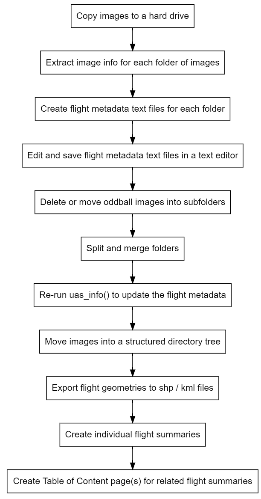
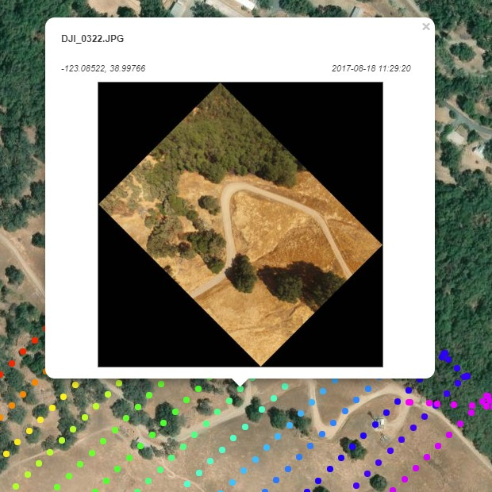

# Motivation

```{r setup, include=FALSE}
#knitr::opts_chunk$set(echo = FALSE)
library(uasimg)
```

```{css echo = FALSE}
div.quote {
  width:1000px;
  margin:4em auto;
  line-height:52px;
  font-size:40px;
  font-family: 'Book Antiqua', 'Palatino Linotype', Palatino, serif;
}
  
span.quotechar {
  color:lightgray; 
  font-family:century-supra-text;
  font-size: 220%;  
}

ul {
  margin-left: 2.5em;
}
h1 {
  color:#111;
}
h1.title {
  padding-top:2em;
}

h2 {
  font-size:1.2em;
  color:#007020;
}
```


<script language="javascript" type="text/javascript">w3c_slidy.mouse_click_enabled = false;</script>

**Drone mapping takes a lots of images...**

{style="margin-left:5px;"}

\

**...but it's not just images that you have to keep track of!**

<div style="float:left; width:260px; margin-left:2em; line-height:1.65em;">
flight logs  
study area outline  
GCP coordinates  
telemetry files  
field data  
other photos  
video files
basemap layers
</div>


<div style="clear:both;"></div>

--- 


<div class="quote" style="margin-top:1em; text-align:center;">
<span class="quotechar">&ldquo;</span>I know it's here somewhere.<span class="quotechar">&rdquo;</span><br/><br/>

</div>


---

<div class="quote" style="text-align:center;">

<span class="quotechar">&ldquo;</span>
Yeah, I remember hearing someone<br/>from UCSB flew that site.<span class="quotechar">&rdquo;</span><br/>
<br/>
<span class="quotechar">&ldquo;</span>Did you ask Brandon?<span class="quotechar">&rdquo;</span>

</div>

---

<div class="quote" style="text-align:center;">
<span class="quotechar">&ldquo;</span>I found the images, but I can't reproduce the stitching. It looks funny.<span class="quotechar">&rdquo;</span><br/><br/>
<span class="quotechar">&ldquo;</span>Maybe your overlap was too low?<span class="quotechar">&rdquo;</span>
</div>

---

<div class="quote" style="text-align:center;"><span class="quotechar">&ldquo;</span>
We have to report how many acres we've flown with each type of camera for the USDA report.<br/><br/>Whatdyathink?
<span class="quotechar">&rdquo;</span>
</div>

---

<div class="quote" style="text-align:center; margin-top:2em;">
How do we get our drone data to be FAIR compliant?<br/><br/>

</div>

# `uasimg` Overview

<div style="float:left; width:900px; margin-left:2em; line-height:1.65em;">
R package with functions to help you:

* create catalogs of your images
* record your flight metadata  
* create GIS layers of your data collections  
* store your images in a directory structure that will allow you to find them again  
* share your metadata and data with others  
* prepare individual images for visualization and analysis in other applications  
* deal with annoying data management tasks
</div>



<div style="clear:both;"></div>

\

# Sample Data Catalogs

[UC Merced Vernal Pool and Grassland Reserve](http://uas.igis-data.click/ucm/index.html)

[Point Pinole Regional Shortline Eucalyptus Grove](http://uas.igis-data.click/ptpinole/wg_flt03_report.html)

[Hopland River Fire Revegetation Study](http://uas.igis-data.click/hrec/riverfire/2020/msp/)

\

# Origins

{style="border:5px solid lightgrey; padding:5px;"}  
<https://is.gd/uas_data_aag2019>

\

## Why R?

  

* full featured scripting language  
* wrappers for open source libraries (exiftool, gdal, geos)  
* good reporting engine  
* good deployment system  
* good tools to create GUIs

\

# Image Metadata vs Flight Metadata

<div style="margin-left:2em;">

**Image metadata**

* camera make and model, dimensions, GPS coordinates, yaw, focal length, aperture, etc.  
* stored in the images themselves  
* essential for photogrammetry  

\

**Flight metadata**

* depends on the project / organization  
* examples: name of the site, project, pilot, aircraft, flight notes  
* not critical for photogrammetry, but essential for good data management
* `uasimg` uses flight metadata for i) **cataloging**, ii) **searching**, and iii) **creating directory trees**  
* see also: [Flight Metadata](https://ucanr-igis.github.io/uasimg/articles/flight_metadata.html){target="_blank" rel="noopener"} Vignette.

</div>

\

# Catloging Workflow

<https://ucanr-igis.github.io/uasimg/articles/catalog_wrkflw.html>

<center>

</center>

\

# Create Flight Info Objects

## Step 1. Extract Image Metadata

<div style="margin:0 2em;">
```{r eval = FALSE}
ptpinole_info = uas_info("d:/uas/ptpinole/west/march2020/dcim")
```
</div>

<div style="margin:0 4em;">

This will:

1) extract the image coordinates
2) read the sensor type, location, yaw, focal length, etc.
3) compute image footprints
4) create an minimum convex polygon (MCP) for the entire flight
5) read flight metadata
6) cache all the results
7) return a "Flight Info" object

You can process multiple directories at once
 
A "Flight Info" object by itself is not very useful! 

</div>

\

## Step 2. Entering Flight Metadata

<div style="margin:0 2em;">

Recommended way to record flight metadata - text editor

{style="border:1px solid gray;"}  

* Any field name allowed. Defaults:

<div style="margin:0 2em;">
```{r}
uas_flds_oem()
```
</div>

</div>

\

## Flight Metadata Helper Function

<div style="margin:0 2em;">

You don't have to start from scratch!

<div style="margin:0 2em;">
```{r eval=FALSE}
uas_metadata_make(ptpinole_info)
```
</div>

- create a *metadata.txt* file for every image directory in *x*  
- you can customize field names with `uas_setflds()`  
- can pre-populate values from a template ([example](https://gist.githubusercontent.com/ajlyons/d0826f4775413ba27a21c62aff619bc2/raw/a6f3dde133652a729283b0e03f8a923f54f73a67/hrec_riverfire2020_metadata){target="_blank" rel="noopener"})  
- open them in text editor  

**TIP:** Re-run `uas_info()` after you edit flight metadata text files!

</div>

\

# Organize Your Files

## Parse an image collection into individual flights

<div style="margin:0 2em;">
```{r eval=FALSE}
uas_grp_flt()
```
</div>

<div style="margin:0 2em;">

Create separate Flight Info objects if you have:

 - Multiple flights in one folder

 - One flight spread across multiple folders

</div>

\

## Rename Files

<div style="margin:0 2em;">
```{r eval=FALSE}
uas_rename()
```
</div>

<div style="margin:0 2em;">

Rename files based on a template, such as:

`{proj}-{loc}_{camera_abbrev}_{Y}{m}{d}_{H}{M}{S}`

Fields available:

- `{i}` an integer starting from 1 and going up, padded with enough leading zeros to accommodate all values  
- `{Y}` year (4-digit)  
- `{y}` year (2-digit)  
- `{m}` month (2-digit)  
- `{d}` day (2-digit)  
- `{j}` Julian day  
- `{H}` hour (2-digits)  
- `{M}` minutes (2-digits)  
- `{S}` seconds (2-digits)  
- `{camera_abbrev}` an abbreviated name of the camera  
- `{alt_agl}` altitude above the launch point  
- \+ all your flight metadata

</div>

\

## Move Your Data into Standard Directory Trees

<div style="margin:0 2em;">


You can move your data by hand or with a function:

<div style="margin:0 2em;">
```{r eval=FALSE}
uas_move()
```
</div>

Options:

* move or copy images
* create the directory tree from a template text file:

<div style="font-family:monospace; font-size:16px; margin:1em 4em; border:1px solid gray; background-color:#eee;">
{proj}/{loc}/{subloc}/imgs/{flt_date}/{flt_start}-{flt_end}_{camera_abbrev}  
{proj}/{loc}/{subloc}/gis  
{proj}/{loc}/{subloc}/p4d  
{proj}/{loc}/{subloc}/documents  
</div>

* placeholders in {} will be replaced with flight and/or image metadata   
* you can use *any* flight metadata field and a subset of image metadata fields  
* the first directory should be where you want the images to go  
* you can create additional directories for other parts of your workflow

</div>

\

# Export Flight Geometry as GIS files

<div style="margin:0 2em;">
```{r eval = FALSE}
uas_exp_kml(ptpinole_infox)
uas_exp_shp(ptpinole_info)
```
</div>

<div style="margin:0 2em;">

Geometries you can export:

* image center points
* modelled footprints  
* flight area (minimum convex polygon of all the images)

</div>

\

# Catalog Your Data

## Create Individual Flight Summary Reports

<div style="margin:0 2em;">

Create HTML flight summary for one or more Flight Info object(s):

<div style="margin:0 2em;">
```{r eval = FALSE}
uas_report(ptpinole_info)
```
</div>

Report options:

- report title
- map of image locations
- show image thumnbnails
- group image locations into 'clusters'
- data URL  
- custom header / footer
- directory where the images are saved on your local machine
- hyperlinks to download the KML files
- create an image thumbnail of the entire flight area (requires a Google Maps or Stadia API key)  

</div>

{style="display:block; margin:1em auto;"}

\

## Group Flight Summaries into Catalogs

<div style="margin:0 2em;">

Feed a list of Flight Summary HTML files. 

<div style="margin:0 2em;">
```{r eval=FALSE}
uas_toc(c("d:/uas/ptpinole/west/march2020/dcim/map/ptpinole_mar2020.html",
          "d:/uas/ptpinole/west/jul2020/dcim/map/ptpinole_jul2020.html",
          "d:/uas/ptpinole/west/oct2020/dcim/map/ptpinole_oct2020.html"))
```
</div>

It will extract flight metadata fields from the HTML file for the table-of-contents.

Function options:

- title & HTML header/footer  
- copy all the individual Flight Summary HTML files to one place  
- show a map of all the flight areas  
- include hyperlinks to download all flight areas as a single KML  

**Example:** <http://uas.igis-data.click/hrec/watershed2/>

</div>

\

## Sample Script

<div style="margin:0 2em;">

```{r eval=FALSE}
library(uasimg)

## Define the subdirectories that have the images
hrec_dirs <- c("D:/Pix4D/HREC/Watershed1/Data/2017-01-16_X5/Flight01_1514_1526_400ft",
               "D:/Pix4D/HREC/Watershed1/Data/2017-01-16_X5/Flight02_1532_1540_400ft")
file.exists(hrec_dirs)

## Create/edit metadata text files
# uas_metadata_make(hrec_dirs, make_new = TRUE, overwrite = FALSE, open = TRUE, use_system_editor = TRUE)

## Extract image and flight metadata
hrec_info <- uas_info(hrec_dirs, fp = TRUE)

## Create image thumbnails (optional)
uas_thumbnails_make(hrec_info, rotate = TRUE, stats = TRUE, overwrite = FALSE)

## Create flight summary reports
hrec_rpts <- uas_report(hrec_info,
                        thumbnails = TRUE,
                        attachments = c("mcp_kml", "ctr_kml"),
                        footer_html = "D:/Pix4D/catalog/headers_footers/footer_igis.html",
                        tbm_use = TRUE,
                        tbm_src = "Google",
                        tbm_api_key = getOption("ANDYS_GOOGLE_STATIC_MAPS_KEY"),
                        tbm_overwrite = FALSE,
                        group_img = FALSE,
                        show_local_dir = TRUE,
                        overwrite_html = TRUE,
                        open_report = TRUE)

## Create a TOC
hrec_toc <- uas_toc(hrec_rpts,
                    toc_title = "HREC Watershed 1, January 2017",
                    output_dir = "D:/Data/uas.igis-data/hrec/watershed1",
                    gather = ".",
                    fltmap_base = list(list(kml_fn = "D:/Pix4D/HREC/Baselayers/hopland.kml",
                                            color = "yellow",
                                            weight = 2)),
                    fltmap_kml = TRUE,
                    footer_html = "D:/Pix4D/catalog/headers_footers/footer_igis.html",
                    open_toc = TRUE,
                    overwrite_toc = TRUE)

## Output: http://uas.igis-data.click/hrec/watershed1/
```
</div>

# Utilities for Individual Images

## World Files

<div style="margin:0 2em;">

'World Files' are plain-text files (also called sidecar files) with location and projection info. 

GIS software like ArcGIS Pro and QGIS use these files to display images in the proper place and size.

Generate with:

<div style="margin:0 2em;">
```{r eval = FALSE}
uas_worldfile(ptpinole_info)
```
</div>

Options:

* World File format (`aux.xml`, `wld`, or `prj`)
* include yaw   

Output:

{style="border:1px solid lightgrey; width:600px; margin-left:5px;"}

\

With World files, your images will just "pop" into place (approximately) in your GIS software:


\

</div>

## Crop Out Overlap

<div style="margin:0 2em;">

If your images can't be stitched, life is not over!

This function will crop each image, keeping the center part (least distorted)

<div style="margin:0 2em;">
```{r eval = FALSE}
uas_cropctr(ptpinole_info)
```
</div>

Function options:

* specify the crop dimensions in the image horizontal and vertical axis in meters

Example Output:


Not great, but...

* If the ground is flat and the features are short, might be good enough.  
* If you're counting things in individual images, might be good enough.  
* If you know you won't be able to stitch images (i.e., open water), consider flying at "zero percent" overlap and use this technique to verify you're not double-counting.

</div>

\

## Convert between file formats

<div style="margin:0 2em;">

Convert between JPG, TIF, and DNG __without__ losing all the image metadata (EXIF info):

<div style="margin:0 2em;">
```{r eval = FALSE}
uas_convert()
```
</div>
</div>

\

## Save Images as Pseudo-Georeferenced GeoTIFFs

<div style="margin:0 2em;">
```{r eval = FALSE}
uas_exp_geotiff()
```
</div>

<div style="margin:0 2em;">

Open images with remote sensing tools for:

- spatial joins and overlays  
- pixel classification  
- compute vegetation indices   
- zonal stats  
- object detection with AI  

</div>

\


# In the pipeline...

## Scaling for Production

<div style="margin:0 2em;">

* version 2.0 - more pipe friendly
* wrapper functions / code recipes  
* automate production with an Excel based control panel  
* standalone flight metadata editor

</div>

\

## Making your data discoverable

<div style="margin:0 2em;">

* generate XML files for Google Dataset Search  
* publish your data catalogs as AGOL web maps  

</div>

\

## Adding Related Data to the Catalog

<div style="margin:0 2em;">

* flight logs, uncorrected images, calibration files, etc.  
* processed data   
* quality reports  
* processing settings  

</div>

\

# Summary

<div style="display:flex; align-items:start;">

<div>
The need for data management tools and workflows increases as you:

- accumulate more and more data  
- work in a team  
- are mandated to archive your data for the long term  
- are mandated to make the existence of your data known to others  
</div>

<div style="text-align:center; margin-left:2em;">
<br/>https://ucanr-igis.github.io/uasimg/
</div>

</div>

\

<div style="text-align:center;">
Data management and creating metadata will never be fun, but
<p style="font-family:century-supra-text; font-style:italic; font-weight:bold; font-size:150%;">We all stand to gain if we get better at this.</p>
</div>

\
